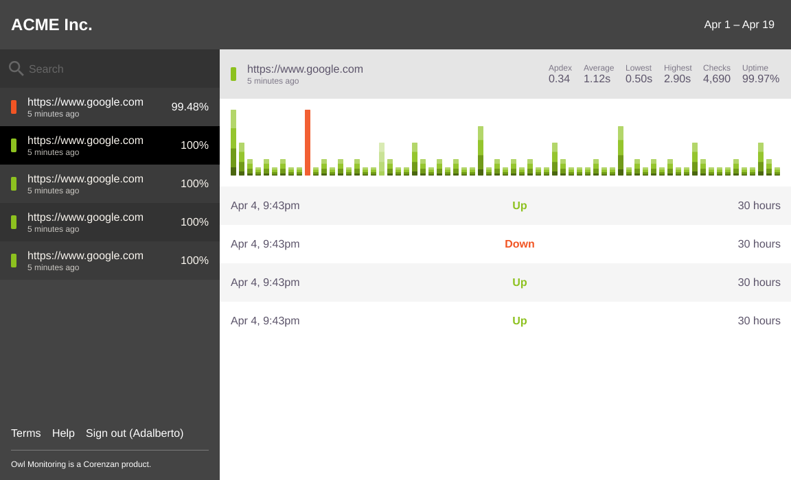

# Owl

> Owl is an open source self-hosted solution for website monitoring and status report.



## About

Owl comprises three packages:

1. A web server that handles all the data in and out of the database.
2. An agent that can check HTTP endpoints and post the results to the server.
3. A client that displays a dashboard and allows users to manage what websites to check.

## Development

You'll need docker-compose 1.23+. Simply run:

```sh
$ docker-compose up
```

### Server

Located at [./api](api).

The server is a web service written in Go using [Echo](https://echo.labstack.com/) and backed by PostgreSQL 11. The container will watch for source file changes and automatically rebuild.

### Agent

Located at [./agent](agent).

The agent is a Go package designed to be invoked from a standalone Go program. The container will watch for source file changes and automatically run its test suite.

The agent also comes with two sample applications:

- [./agent/lambda](agent/lambda) wraps the agent to run on Amazon Lambda.
- [./agent/cli](agent/cli) wraps the agent to be ran from a CLI.

### Client

The client is a React application controlled by [create-react-app](https://github.com/facebook/create-react-app).

## Deploy

⚠️ Although both the server and the client share the same repository **they're deployed separately**. For heroku like environments you can use [git-subtree](https://github.com/apenwarr/git-subtree/blob/master/git-subtree.txt). e.g.

```shell
$ git subtree push --prefix server heroku master
```

## License

The MIT License © 2019 Corenzan
